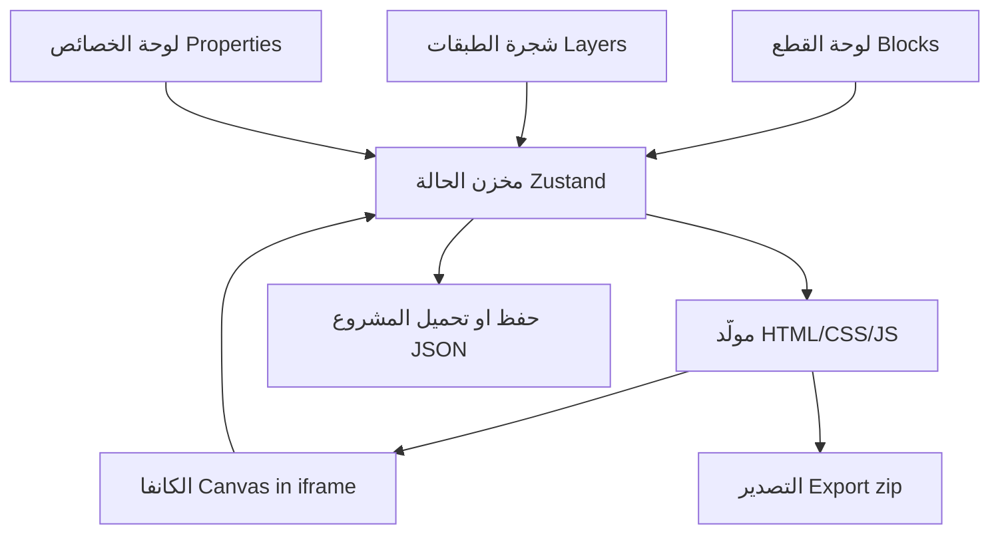

# قطمة (Qitma) - محرّر مواقع ويب بصناديق البناء الأولية

- التاريخ: 2026-10-01
- الحالة: تصميم مُتفق عليه مرحليًا (بانتظار مراجعة بقية الأقسام)
- المستودع: https://github.com/NadimShams-Eldin/WebBuilder

## 1. الرؤية

"قطمة" برنامج ويب لتصميم وتحرير مواقع الويب الكاملة. الفكرة الجوهرية: بدلًا من
إعطاء المستخدم قوالب جاهزة (كما في Bootstrap Studio)، نعطيه **عناصر أولية** (قطع
ليجو) يركّبها بنفسه ليبني أي قالب أو موقع، مع متحكمات وخصائص وتحركات تغنيه عن
الدخول في تفاصيل الكود.

المشروع مستوحى من تفكيك مكتبة Bootstrap Studio إلى أصولها الأولية: كل القوالب
والمكوّنات الجاهزة هناك ليست إلا **تراكيب (recipes)** من عدد صغير من الأصول
الأولية. هدف "قطمة" توفير تلك الأصول + آلية التركيب والحفظ، لا القوالب.

## 2. القرارات المتخذة مع المستخدم

| القرار | الاختيار |
| --- | --- |
| نموذج القطع | عناصر أولية فقط بحرية كاملة (نموذج Figma) |
| نظام التخطيط | تدفّق مرن Flex/Grid (ناتج HTML متجاوب حقيقي) |
| مخرجات التصدير | ملف موقع HTML/CSS/JS قابل للتنزيل (static) |
| الأصول السلوكية | مؤجّلة إلى ما بعد v1 |
| التقنية | React + Vite + TypeScript + Tailwind + Zustand |
| نطاق v1 | الأساسية + صفحات متعددة + حركات الظهور (الكل معًا) |

## 3. تحليل Bootstrap Studio (مرجع التفكيك)

Bootstrap Studio مبني فوق Bootstrap، وتصديره HTML/CSS/JS نظيف. لوحاته:

- Components (سحب وإفلات، مجموعات Studio/Online)
- Overview (شجرة الطبقات)
- Options: **Appearance** (خصائص CSS)، **Options** (كلاسات Bootstrap)،
  **Animations** (ظهور عند Scroll/Hover/Load)
- Design (الصفحات، الصور، الخطوط)
- Editor (HTML/CSS/SASS/JS)

### التفكيك إلى أصول أولية

| مجموعة Bootstrap Studio | الأصل الأولي المقابل | النوع |
| --- | --- | --- |
| Layout | حاوية / صف-عمود Flex / Grid / فاصل / مسافة | تخطيط |
| Typography | نص / عنوان / قائمة / رابط نصي | محتوى |
| Media | صورة / أيقونة / فيديو-Embed | محتوى |
| Buttons | زر | تفاعلي |
| Forms | حقل إدخال + نموذج | تفاعلي |
| Navigation / Content / UI | ليست أصولًا، بل تراكيب: Navbar = حاوية + قائمة + أزرار؛ Card = حاوية + صورة + نص + زر؛ Accordion = حاوية + نصوص + سلوك فتح/إغلاق؛ Carousel = حاوية + صور + سلوك تنقّل | تراكيب قابلة لإعادة البناء |

## 4. الأصول الأولية لـ v1

### أصول التخطيط
- `container` - حاوية بعرض مركزي
- `flex` - صندوق مرن (اتجاه/محاذاة/توزيع/التفاف/gap)
- `grid` - شبكة
- `spacer` - مسافة
- `divider` - فاصل

### أصول المحتوى
- `heading` - عنوان
- `text` - نص
- `list` - قائمة
- `link` - رابط
- `image` - صورة
- `icon` - أيقونة
- `video` - فيديو/Embed

### أصول التفاعل
- `button` - زر
- `input` - حقل إدخال (نص/textarea/select/checkbox/radio)
- `form` - نموذج

### أصول سلوكية (مؤجّلة لما بعد v1)
- فتح/إغلاق (Toggle/Collapse)، تبويب (Tabs)، نافذة منبثقة (Modal)،
  شرائح (Carousel). هذه هي التي تنتج مكوّنات مثل الأكورديون والسلايدر.

> ملاحظة: "الأحزمة" الظاهرة في الواجهة ليست قطعًا جاهزة، بل مجموعات
> (تجمعات) يصنعها المستخدم من عناصر أولية ثم يمكنه حفظها كقطعة لإعادة الاستخدام.

## 5. نموذج البيانات (شجرة العناصر)

كل شيء عبارة عن **شجرة عناصر**. المشروع كامل ملف JSON واحد:

```
Project { id, name, theme, pages[], assets[] }
Page    { id, name, slug, root: Node }
Node    { id, type, name, props, style, animation, children[] }
```

- **type**: أحد الأصول الأولية فقط (انظر القسم 4).
- **props**: محتوى خاص بالنوع (نص العنوان، src الصورة، نوع الزر/الحقل...).
- **style**: قائمة بيضاء من خصائص CSS مصنّفة (تخطيط، أبعاد، مسافات، خطوط،
  ألوان، حدود، ظلال، تأثيرات).
- **animation**: `{ trigger: scroll|hover|load, effect: fade|slide-up|zoom|..., delay, duration, easing }`.
- **children**: العناصر المتداخلة. العناصر `container/flex/grid/form` تقبل
  أبناء، وبقية العناصر "أوراق".

مبدأ مهم: **مصدر واحد للحقيقة**. نفس دالة توليد HTML/CSS تُستخدم في الكانفا
وفي التصدير، فيتطابق المعروض مع المُصدَّر 100%.

## 6. البنية والمكوّنات



- **الكانفا داخل iframe معزول**: لأن تطبيق المحرّر نفسه يستخدم Tailwind، نعرض
  شجرة المستخدم داخل `iframe` بأنماط مستقلة، فلا تتعارض الأنماط ويتطابق العرض
  مع الناتج. النقر داخل الكانفا يُبلّغ المحرّر بالعنصر المحدَّد عبر `postMessage`،
  ونرسم فوقه إطار التحديد ومؤشرات الإفلات.
- **إدارة الحالة**: Zustand، مع سجلّ **تراجع/إعادة** (Undo/Redo) مبني على
  لقطات/فروقات العنصر.
- **السحب والإفلات**: من لوحة القطع إلى الكانفا (إدخال داخل حاوية مع مؤشر موضع)،
  وإعادة الترتيب من شجرة الطبقات.
- **الصفحات**: `pages[]` كلها بنفس المولّد؛ التنقّل بين الصفحات والروابط بينها.

## 7. خطة المراحل (نظرة أولية)

1. تهيئة المشروع (React + Vite + TS + Tailwind) + مخزن الحالة ونموذج الشجرة.
2. لوحة القطع + الكانفا (عرض) + مولّد HTML/CSS.
3. التحديد + شجرة الطبقات + لوحة الخصائص.
4. السحب والإفلات + التراجع/الإعادة.
5. تكبير/تبديل الأجهزة + حركات الظهور.
6. صفحات متعددة + حفظ/تحميل JSON.
7. التصدير إلى ملف موقع HTML/CSS/JS قابل للتنزيل.

## 8. الواجهة المرجعية

تعتمد الواجهة تخطيطًا من ثلاث مناطق (RTL): يمين = القطع/الطبقات/المحتوى
المستخرج، الوسط = الكانفا مع تبديل الأجهزة، يسار = خصائص العنصر المحدد،
أعلى = تبويب لوحة التركيب/المعاينة الحية + Publish + تراجع/إعادة،
أسفل = تصدير ويب حي.
